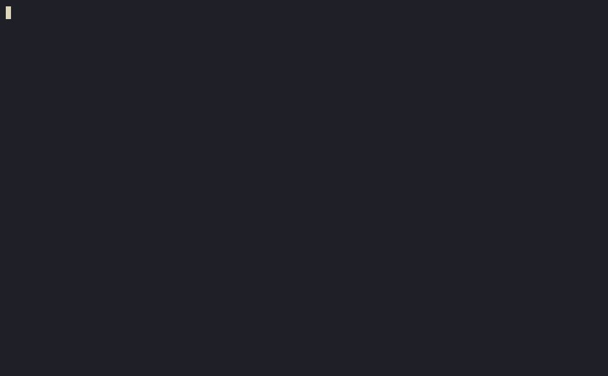

# typist

An adaptive typing trainer with a Go backend and TUI client. The trainer
tracks per-key and per-ngram competency separately, generates lessons
targeted at your current weak points, and progressively introduces new
characters and ngram patterns as you improve.

> Status: under construction. See [`docs/architecture.md`](/docs/architecture.md)
> for the design and [`docs/adr/`](/docs/adr/) for the decisions behind it.

## Quickstart

Bring up the API and Postgres:

```bash
git clone https://github.com/corygyarmathy/typist
cd typist
docker compose -f deploy/docker/compose.yaml up
```

The API is now available at `http://localhost:8080`. Health check:

```bash
curl http://localhost:8080/healthz
```

Every endpoint except registration and login is authenticated, so the TUI
needs a bearer token. Register once (the password must be at least eight
characters) and export the `token` from the response:

```bash
export TYPIST_TOKEN=$(curl -s -X POST http://localhost:8080/api/v1/auth/register \
  -H 'Content-Type: application/json' \
  -d '{"email":"you@example.com","password":"correcthorse"}' | jq -r .token)
```

Then play a lesson:

```bash
make tui
```

The client reads `TYPIST_API_URL` (default `http://localhost:8080`) and
`TYPIST_TOKEN`. The token is not yet persisted between shells - see the
`$XDG_STATE_HOME` token storage row in
[`docs/plans/minimal-path-to-demo.md`](docs/plans/minimal-path-to-demo.md).

## Demo



One lesson, start to finish: the server generates it from the keys this user
has unlocked, the client types it under force-correction, and the submission
comes back as a server-derived `34 wpm, 96.2% accuracy`. The competency behind
it moves in the same transaction.

The recording is `docs/demo.cast`; `make demo-gif` re-renders the gif from it.
This is the single-screen client described in
[`docs/plans/minimal-path-to-demo.md`](docs/plans/minimal-path-to-demo.md) - no
history, heatmap or login screen yet.

## What's interesting in here

- **[`internal/engine`](internal/engine)** - the adaptive engine. Pure
  functions, no I/O, heavily unit-tested. This is where the actual domain
  reasoning lives.
- **[`api/openapi.yaml`](api/openapi.yaml)** - API contract. Server
  interfaces are generated from this; handlers implement them.
- **[`docs/adr/`](docs/adr/)** - architecture decision records explaining
  the choices that aren't obvious from the code.

## Development

For reproducible dev tooling, use the Nix flake:

```bash
nix develop
make help
```

Without Nix you'll need Go 1.26+, `goose`, `sqlc`, `oapi-codegen`, and
`golangci-lint` on your `$PATH`. The Docker stack still works without
any of these.

### Making API requests by hand

[`api/bruno/`](api/bruno) is a [Bruno](https://www.usebruno.com/) collection
for exploring the API interactively - log in once and the JWT is captured for
subsequent requests. Open the folder in Bruno and pick the `Local` environment.
See [`api/bruno/README.md`](api/bruno/README.md) for the workflow.

## Architecture (TL;DR)

A Go modular monolith exposing a REST API consumed by a Bubble Tea TUI
client. Postgres for persistence; goose for migrations; sqlc for queries;
JWT for auth. Single binary, deployed via Docker or a NixOS module.

See [`docs/architecture.md`](docs/architecture.md) for the long version.

## Inspiration

- [Keybr](https://keybr.com)
- [Ngram Type](https://ranelpadon.github.io/ngram-type/)
- [Monkeytype](https://monkeytype.com)
- [typ.ing](https://typ.ing)
- [terminal.shop](https://terminal.shop)

## License

MIT
